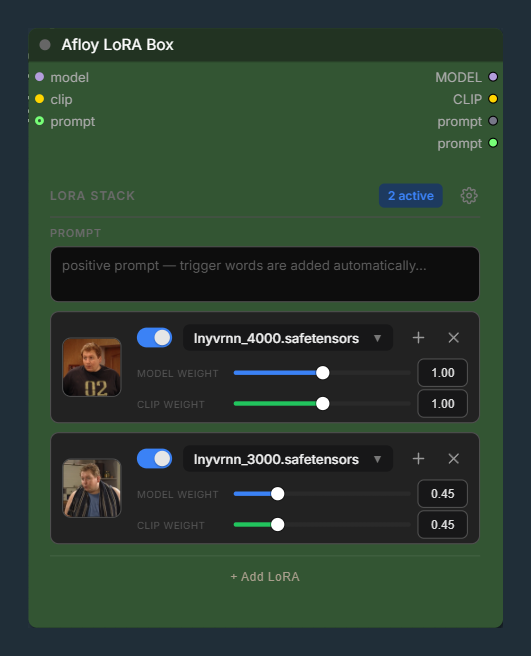
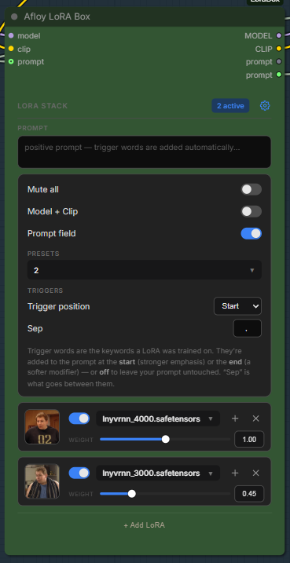
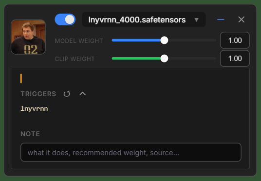

# Afloy Lora Box

A compact multi-LoRA loader for [ComfyUI](https://github.com/comfyanonymous/ComfyUI) — stack LoRAs, auto-merge their trigger words into your prompt, and never fight a broken widget layout again.

[](LICENSE)
[](https://python.org)
[](https://github.com/comfyanonymous/ComfyUI)
[](https://github.com/afloy011-spec/ComfyUI-LoraBox/tags)



<p>
<a href="https://github.com/afloy011-spec/ComfyUI-LoraBox/archive/refs/heads/main.zip"></a>&nbsp;
<a href="#quick-start"></a>&nbsp;
<a href="#nodes"></a>
</p>

> [!NOTE]
> Lora Box exists to sidestep the ComfyUI 1.43 frontend bug that mis-lays-out rgthree's hand-drawn canvas widgets (rows shift / disappear). Its editor is an HTML overlay independent of litegraph's widget layout, so it stays stable while offering a clean one-row-per-LoRA design.

## Contents

- [Installation](#installation)
- [Quick Start](#quick-start)
- [Features](#features)
- [Nodes](#nodes)
  - [Afloy Lora Box](#afloy-lora-box)
  - [Prompt + Triggers (Lora Box)](#prompt--triggers-lora-box)
- [Example Workflows](#example-workflows)
- [Configuration](#configuration)
- [Requirements](#requirements)
- [Develop & Test](#develop--test)
- [License](#license)

---

## Installation

> [!IMPORTANT]
> One package, one node folder — install it once and both nodes appear automatically.

### Option A — ComfyUI-Manager / Registry (easiest)

Search **"Afloy Lora Box"** in **ComfyUI-Manager**, or install from the **ComfyUI Registry**. Restart ComfyUI.

### Option B — Download ZIP

1. [**Download ZIP**](https://github.com/afloy011-spec/ComfyUI-LoraBox/archive/refs/heads/main.zip) (or click the green button above).
2. Extract the archive — you'll get a folder `ComfyUI-LoraBox-main`.
3. Move the whole folder into your ComfyUI `custom_nodes` directory.
4. Restart ComfyUI.

### Option C — Git clone

```bash
cd ComfyUI/custom_nodes
git clone https://github.com/afloy011-spec/ComfyUI-LoraBox.git
```

Restart ComfyUI.

After installation your folder structure should look like this:

```
ComfyUI/
└── custom_nodes/
    └── ComfyUI-LoraBox/
        ├── __init__.py
        ├── lora_box.py           ← the node + API routes
        ├── preview_generate.py   ← quick test-render for thumbnails
        ├── pyproject.toml
        ├── LICENSE
        ├── README.md
        ├── examples/             ← ready-to-load workflows
        └── web/
            └── lora_box.js       ← the DOM-panel UI
```

> [!NOTE]
> No extra pip packages needed — the node uses `numpy`, `torch` and the safetensors reader that already ship with ComfyUI. After restart, find it under **Add Node → loaders → Afloy Lora Box**.

<p align="right"><a href="#contents">↑ Back to top</a></p>

---

## Quick Start

> [!TIP]
> Load [`examples/Afloy-LoraBox-Z-Image.json`](examples/Afloy-LoraBox-Z-Image.json) — a clean Z-Image Turbo graph built around Lora Box, using only core ComfyUI nodes (no third-party dependencies).

1. Add an **Afloy Lora Box** node and connect `model` and `clip`.
2. Click a row's **Choose a LoRA…** and pick your LoRA(s) — stack as many as you want; **trigger words fill in automatically**.
3. Type your prompt in the node's **Prompt** field (or connect a `prompt` input).
4. Wire the `prompt` output into your positive **CLIP Text Encode**, and `MODEL` / `CLIP` into the sampler / encoders.
5. **Queue** — one node loads the LoRAs *and* injects their trigger words into the prompt.

<p align="right"><a href="#contents">↑ Back to top</a></p>

---

## Features

- **One row per LoRA** — on/off switch, searchable picker, strength slider + number box.
- **Calm by default** — secondary settings (mute all, separate model/clip strengths, trigger merge position + delimiter) live behind a ⚙ disclosure.
- **Live active count** in the header; **mute all** survives a workflow save without wiping per-row on/off state.
- **Drag-to-reorder** by grabbing a card's thumbnail. Duplicate LoRAs get a **"duplicate"** badge; a LoRA whose file is gone gets a red **"missing file"** badge instead of being silently skipped.
- **Stack presets** — save the current combination (LoRAs + weights + merge settings) under a name and reload it in any workflow.
- **Solo** — right-click a row's switch to mute every *other* LoRA while you test one; right-click again to restore.
- **Per-LoRA notes + Civitai link** — jot what a LoRA does / its recommended weight; the note belongs to the LoRA and shows in every Lora Box.
- **Reversible delete** — removing a row shows an *Undo* toast.
- **Auto trigger words** — detected from real safetensors trigger fields (not noisy training tags), fully editable, resettable to auto, merged straight into the `prompt` output.
- **Per-LoRA preview pictures** — the LoRA's own `<lora>.preview.png` loads automatically; click a thumbnail to Generate (architecture-aware), Upload, or drag & drop an image; hover to enlarge. A custom image is stored as a sidecar, so it belongs to the LoRA.
- **Architecture-grouped picker** — LoRAs are grouped (Z-Image, Flux, Krea, SDXL, SD1.5, …); right-click one to assign a custom group.

| ⚙ options, presets & triggers | Per-LoRA triggers + note |
|:---:|:---:|
|  |  |

<p align="right"><a href="#contents">↑ Back to top</a></p>

---

## Nodes

> [!NOTE]
> Both nodes appear under **loaders** in the Add Node menu.

### Afloy Lora Box

`LoraBox` — the multi-LoRA loader. Loads the LoRA(s) and returns your prompt with their trigger words already merged in.

**Inputs**

<table>
<thead><tr><th align="left"><br>Name</th><th align="left"><br>Type</th><th align="left"><br>Description</th></tr></thead>
<tbody>
<tr><td><code>model</code></td><td><code>MODEL</code></td><td>Base model (required)</td></tr>
<tr><td><code>clip</code></td><td><code>CLIP</code></td><td>Base CLIP (required)</td></tr>
<tr><td><code>prompt</code></td><td><code>STRING</code></td><td>Optional input; if connected, it's returned with trigger words merged in (takes precedence over the in-node Prompt box)</td></tr>
<tr><td><code>data</code></td><td><code>STRING</code></td><td>Hidden — JSON kept in sync by the panel (rows, weights, mute, merge settings, in-node prompt)</td></tr>
</tbody>
</table>

**Outputs**

<table>
<thead><tr><th align="left"><br>Name</th><th align="left"><br>Type</th><th align="left"><br>Description</th></tr></thead>
<tbody>
<tr><td><code>MODEL</code></td><td><code>MODEL</code></td><td>Model with the enabled LoRAs applied</td></tr>
<tr><td><code>CLIP</code></td><td><code>CLIP</code></td><td>CLIP with the enabled LoRAs applied</td></tr>
<tr><td><code>prompt</code></td><td><code>STRING</code></td><td>Your prompt with the LoRA trigger words merged in</td></tr>
</tbody>
</table>

> [!TIP]
> You can type the positive prompt **directly in the node** (the Prompt box), so it needs no external prompt node. Prefer your own? Turn the box off with **Prompt field** in the ⚙ disclosure — then only a connected `prompt` is used. The ⚙ **Trigger position** dropdown (`Start` / `End` / `Off`) controls where trigger words go; set it to **Off** to disable trigger injection entirely (the LoRAs still load).

The strength slider covers the common `0..2` range, but the value box accepts any number: strengths are clamped to `-10..10` (negative "anti-LoRA" weights allowed); non-finite values (NaN/Inf) are rejected.

---

### Prompt + Triggers (Lora Box)

`LoraBoxPromptMerge` — merges a prompt with LoRA trigger words and exposes a single **position** switch to place them at the beginning or end. Replaces the fragile `JoinStrings` + `JoinStrings` + `LazySwitchKJ` combo.

**Inputs**

<table>
<thead><tr><th align="left"><br>Name</th><th align="left"><br>Type</th><th align="left"><br>Description</th></tr></thead>
<tbody>
<tr><td><code>prompt</code></td><td><code>STRING</code> (input)</td><td>The base prompt</td></tr>
<tr><td><code>triggers</code></td><td><code>STRING</code> (input)</td><td>Trigger words (e.g. from Afloy Lora Box)</td></tr>
<tr><td><code>position</code></td><td><code>combo</code></td><td><code>end (append after prompt)</code> / <code>beginning (prepend before prompt)</code></td></tr>
<tr><td><code>delimiter</code></td><td><code>STRING</code></td><td>Default <code>", "</code></td></tr>
</tbody>
</table>

**Output:** `prompt` (`STRING`). Empty sides are handled without stray delimiters, and trigger words already present in the prompt are not duplicated.

<p align="right"><a href="#contents">↑ Back to top</a></p>

---

## Example Workflows

### Basic — Z-Image Turbo (zero dependencies)

[`examples/Afloy-LoraBox-Z-Image.json`](examples/Afloy-LoraBox-Z-Image.json) — a clean, minimal graph built around Lora Box, using only core ComfyUI nodes plus this one.


```
UNETLoader ┐
CLIPLoader ┼─► ModelSamplingAuraFlow ─► Lora Box ─► CLIP Text Encode (+) ─► KSampler ─► VAE Decode ─► Save Image
VAELoader ─┘                              │  └────────► CLIP Text Encode (−) ─┘            ▲
                                          └─ MODEL / CLIP ───────────────────────────────┘
```

> [!NOTE]
> Install the Z-Image Turbo models first: `z_image_turbo_bf16` (UNet), `qwen_3_4b` (CLIP, type `lumina2`), `ae.safetensors` (VAE). The example ships with **empty rows** so it loads clean — just add your own LoRAs. This example is Z-Image Turbo, but the node is **architecture-agnostic** — swap the loaders for an SDXL / Flux base and it works the same.

### Advanced — hi-res upscale + face detailer

[`examples/Afloy-LoraBox-Z-Image-Advanced.json`](examples/Afloy-LoraBox-Z-Image-Advanced.json) adds a **hi-res fix** (pixel-space upscale + a second sampler) and a **FaceDetailer** pass, then shows a **before/after slider** and a **face-detection preview** — ideal for character LoRAs (crisp faces even in full-body shots). Tunables are explained in its on-canvas note.

> [!IMPORTANT]
> The advanced example needs [ComfyUI-Impact-Pack](https://github.com/ltdrdata/ComfyUI-Impact-Pack) (`FaceDetailer` + `UltralyticsDetectorProvider` + the `face_yolov8m` bbox model) and [rgthree-comfy](https://github.com/rgthree/rgthree-comfy) (the before/after *Image Comparer*). Want zero dependencies? Use the basic example above.

<p align="right"><a href="#contents">↑ Back to top</a></p>

---

## Configuration

Everything works out of the box; these are optional knobs for the features that reach outside the node.

### Preview generation

The built-in **Generate** renders a quick test image and saves it as the LoRA's sidecar. It picks a render **engine from the LoRA's detected architecture** — Z-Image, Flux (also used for Krea), SDXL or SD1.5 — so each LoRA renders with the right graph, with a shared seed so thumbnails stay comparable.

Each engine needs its own models installed. If they aren't present, Generate reports exactly what's missing instead of failing cryptically — and **Upload / drag-and-drop** (and the automatic `<lora>.preview.png` sidecar) work regardless.

To point an engine at your own models, either:

- drop a `preview_config.json` next to the node — the Z-Image engine reads flat keys (`{ "unet_name": "...", "clip_name": "...", "vae_name": "..." }`), other engines read a section (`{ "flux": { "unet_name": "...", "clip2_name": "..." }, "sdxl": { "checkpoint_name": "..." } }`), or
- set env vars: `LORABOX_PREVIEW_UNET/_CLIP/_VAE` (Z-Image) or `LORABOX_PREVIEW_<ENGINE>_<KEY>` (e.g. `LORABOX_PREVIEW_FLUX_UNET_NAME`).

Model names are matched leniently (exact first, then a substring of the stem). Force a specific engine with `LORABOX_PREVIEW_ENGINE=flux|sdxl|sd15|zimage`; pick the fallback for unrecognised LoRAs with `LORABOX_PREVIEW_DEFAULT_ENGINE`.

### Picker groups / custom categories

The picker groups LoRAs by architecture, detected from the filename or safetensors metadata. **Right-click** any LoRA in the picker to move it to a different group, create a new one, or revert to auto. The choice is stored by name in `user_categories.json` next to the node, shared by every Lora Box.

### Civitai lookups (opt-in)

When a LoRA has no local trigger words / preview, the node can resolve them from Civitai by file hash. This is **off by default** (it hashes the whole file and sends that hash to a third party). Enable it with `LORABOX_CIVITAI=1` (also accepts `true` / `yes` / `on`).

<p align="right"><a href="#contents">↑ Back to top</a></p>

---

## Requirements

- **ComfyUI** — a recent version (the DOM-panel UI targets frontend 1.43+)
- **Python** — 3.9+
- **Extra pip packages** — none
- **Advanced example only** — ComfyUI-Impact-Pack + rgthree-comfy

## Develop & Test

```bash
python -m unittest discover -s tests -v
```

Tests stub `folder_paths` / `comfy.*`, so they run without a full ComfyUI install.

**Implementation notes**

- LoRA weights and parsed safetensors metadata are cached and keyed by file mtime, so replacing a `.safetensors` on disk transparently re-reads it.
- `IS_CHANGED` hashes the row JSON plus the mtime of each referenced LoRA, so cached outputs / trigger words never go stale.
- The `/lorabox/*` routes only touch files whose name is in the registered loras list (guards against path traversal). Preview uploads are capped at 8 MB and limited to `png/jpg/jpeg/webp/gif`.

## License

This project is licensed under the [MIT License](LICENSE).

<p align="right"><a href="#contents">↑ Back to top</a></p>
